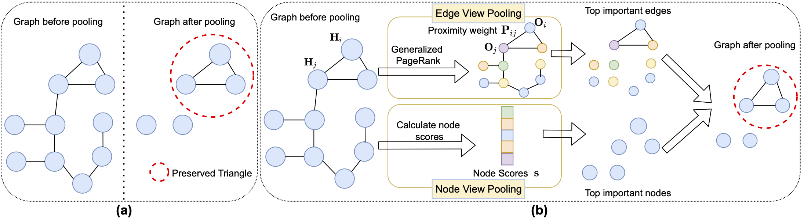

## Co-Pooling
This is the official code for paper "Edge but not Least: Cross-View Graph Pooling" (Pytorch implementation)

Graph neural networks have emerged as a powerful model for graph representation learning to undertake graph-level prediction tasks. Various graph pooling methods have been developed to coarsen an input graph into a succinct graph-level representation through aggregating node embeddings obtained via graph convolution. However, most graph pooling methods are heavily node-centric, but fail to fully leverage the crucial information contained in graph structure. This paper presents a cross-view graph pooling method called Co-Pooling that explicitly exploits crucial graph substructures for learning graph-level representations. Co-Pooling is designed to fuse the pooled representations from both node view and edge view. Through cross-view interaction, edge-view pooling and node-view pooling reinforce each other to better learn informative graph-level representations. Extensive experiments on one synthetic and 15 real-world graph datasets validate the effectiveness of our Co-Pooling method. Our experiments and analysis demonstrate that (1) our method is able to yield promising results over graphs with various types of node attributes. (2) our method can achieve superior performance over state-of-the-art pooling methods on both graph classification and regression tasks.



## Packages Requirement

```
    python            
    scikit-learn     
    torch           
    torch-geometric
    networkx          
    matplotlib      
```

## Training Model

```
sh nci.sh # you could change the parameters in the sh file, i.e. different hyper-parameters; different datasets
```
